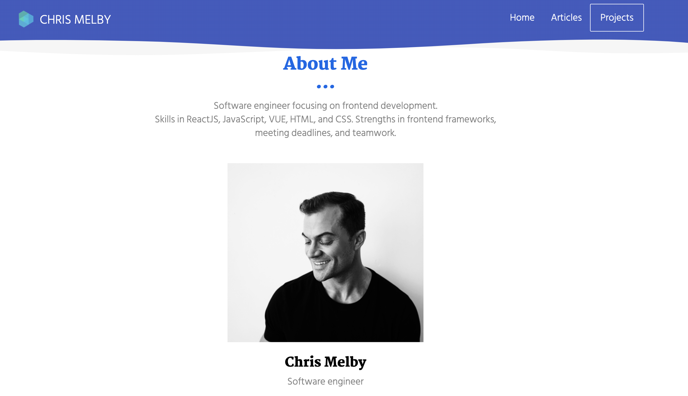

# Portfolio

 
## Summary 
This portfolio houses samples of work that I have created and can be used to gain insight into my skills and knowledge. You can find links to demo the different pieces along with their respective repository in GitHub, as well as links to my LinkedIn and personal GitHub profile. You will also be able to find out a little about me in the about me tab at the bottom along with a list of skills I have developed.

## Technologies Used
- jQuery - Used for event listeners of parent and childeren elements as well as to store and recall those varible in local      storage to be displayed dynamically in HTML on the page.
- momentjs - Used to pull current date for the current city.
- javascript - Used to dynamically change html and store user-input.
- HTML - Used to create elements on the DOM
- CSS - Styles html elements on page
- Git - Version control system to track changes to source code
- GitHub - Hosts repository that can be deployed to GitHub Pages

## Built With

* [jQuery](https://api.jquery.com/)
* [HTML](https://developer.mozilla.org/en-US/docs/Web/HTML)
* [CSS](https://developer.mozilla.org/en-US/docs/Web/CSS)
* [Boostrap](https://getbootstrap.com/)

## Authors

**Chris Melby**
- [LinkedIn](https://www.linkedin.com/in/chris-melby-71106b126/)
- [Link to Github](https://github.com/cmelby)
- [Portfolio](https://cmelby.github.io/portfolio/)

